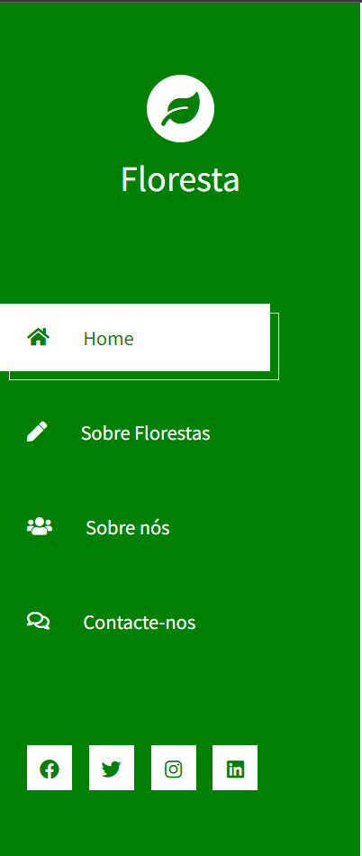
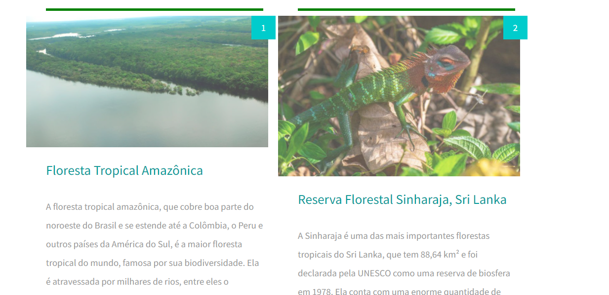
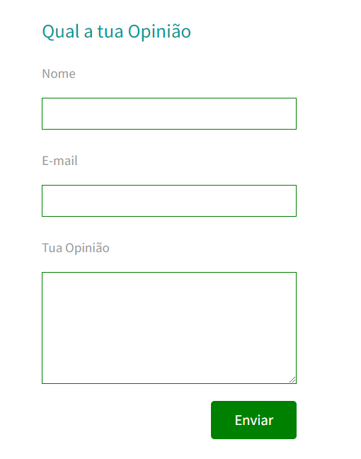
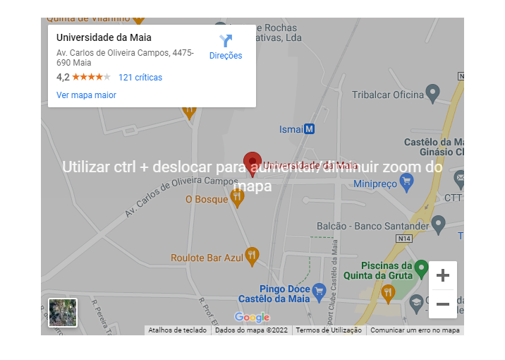
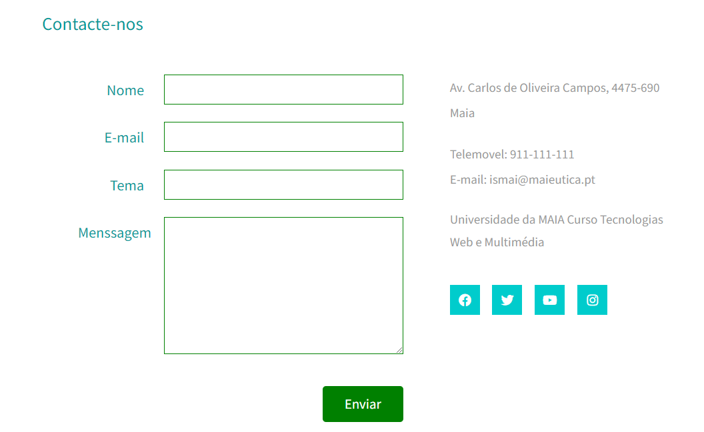

# Relatório de tiwm2021-ti-g06 <h1>

### ***Grupo*** <h3>

* Rui Folha | A036798
* António Nazario | A041162 
* João Silva | A041198

## Link para netlify <h2>
<tiwm2021-ti-g06.netlify.app>

### Indice <h3>
* Grupo
* Indice
* Definição do tema
* Interface
* Produto
* Conclusão

### Definição do Tema <h3>

 
Este projeto consiste na criação de um website informativo que tem como objetivo dar informação sobre o diferente tipo de Florestas, a informação apresentada no site será resultada da pesquisa do grupo em relação ao tema escolhido. O website será constituído por páginas HTML estáticas, onde o design será feito em CSS. O site vai ser composto por uma página inicial que vai apresentar os tipos de floresta com imagens, legenda e local onde elas se situam. Ao carregar no link na s imagens, o utilizador será direcionado para uma outra. 
A página que contem a informação sobre sas floresta também será acompanhado com um pequeno texte á cerca da importancia das florestas e tbm comentarios sobre esse pequeno texto. Para alem disso, o website também irá ter uma página com um formulário para que o utilizador possa entrar em contacto com o grupo, para o caso dele se encontrar com duvidas em relação ao conteúdo encontrado no website. Também iremos ter una página na qual falamos sobre nós.No site vamos utilizar toda a matéria que foi lecionado/praticada ao longo do semestre para um melhor aproveitamento do conteúdo que aprendemos.

### Interface <h3>

    Criamos uma sidebar onde o utilizador navega pelo site.
    Temos as várias páginas que o utilizador pode navegar como:

    Aqui o utilizador pode ver as fotos dos variuos tipos de florestas e ainda pode ler os textos sobre elas e ainda ver a sua localização

    Aqui o utilizador pode ler o texto que se encontra na página e ainda dar a sua opinião

    Na pagina em que o utilizador nos pode contactar contém um painel onde mostra a localização da nossa universidade e também nos contactar

### Produto <h3>

    O produto final é composto por 4 páginas estáticas de HTML, ao entrar no stie o utilizador será direcionado para a página Home do site onde vai encontrar as imagens e textos que já referimos,
    Criamos também sois butões, o : "Prev" e o "Next" que como indica é para andar para a página anterior ou para a página seguinte.
    Se o utilizador nao quiser andar de página em página tem entao o painel lateral onde poderá escolher a página que assim prefere e navegar nela, também temos os links/butões que caso o utilizador queira o redirecionará para as redes sociais.
    Para a formatação do HTML foi usado CSS e foi usado javascript para animar certas partes do website.

### Conclusão <h3>

    Com este Projeto feito, podemos dizer que ele foi bastante beneficial, pois podemos aprofundar os nossos conhecimentos na área de informática e trabalhar as nossas habilidades como desenvolvedores de websites onde aprendemos maneiras de mostrar dados e informações estáticas. Também deu para trabalhar um bocado no nosso trabalho de pesquisa e trabalho em equipa porque tivemos que analisar artigos e perceber neles a informação lá escrita e qual seria relevante para este nosso trabalho. Finalmente deu-nos mais treino em relação a construção de relatórios visto que é muito útil para a faculdade como também para futuros empregos.

